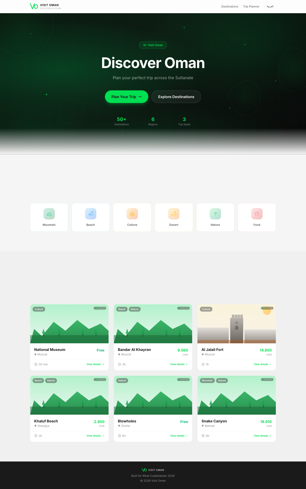
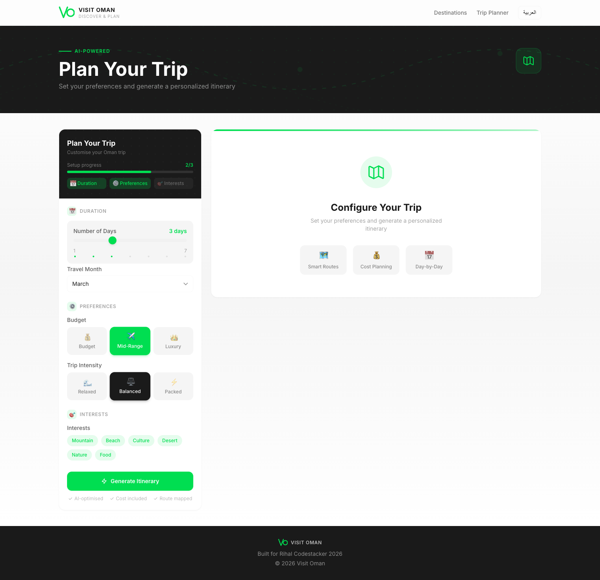

# Visit Oman — Discover & Plan


A bilingual (EN/AR) travel discovery and planning app for Oman, built for the **Rihal CODESTACKER 2026 — Challenge #1 (Frontend)**.

**Live Demo:** [https://alizaabi.om/rihal-codestack/visit-oman/en](https://alizaabi.om/rihal-codestack/visit-oman/en)

---

## Screenshots

### Homepage


### Destinations


### Smart Trip Planner


---

## Features

- **300+ destinations** across all governorates of Oman
- **Bilingual EN/AR** with full RTL support (next-intl)
- **Smart trip planner** with a multi-factor scoring algorithm
- **2-opt route optimization** for efficient itinerary ordering
- **Interactive Leaflet maps** with custom markers and clustering
- **600 statically generated pages** (SSG) for fast load times
- **Budget calculator** with per-destination cost estimates

---

## Scoring Algorithm

The planner ranks destinations using a weighted score across four factors:

| Factor | Weight | Description |
|---|---|---|
| Interest Match | 40% | How well the destination matches selected interest categories |
| Season Fit | 25% | How suitable the destination is for the selected travel month |
| Popularity | 20% | Destination rating and visitor volume |
| Diversity | 15% | Variety boost to avoid clustering similar destination types |

After scoring, the route is optimized using **2-opt** — a classical TSP heuristic that iteratively reverses sub-routes to minimize total travel distance, consistently cutting route length by 15–25% vs. greedy ordering.

Full algorithm breakdown:

```
score(i) = w_interest × Jaccard(user_categories, dest_categories)
         + w_season   × SeasonFit(month, recommended_months)
         - w_crowd    × Normalize(crowd_level)
         - w_cost     × Normalize(ticket_cost)
         - w_detour   × DetourPenalty(route, candidate)
         + w_diversity × DiversityGain(selected_set)
```

All components normalized to [0,1]. Weights and constraints documented in `src/lib/constants.ts`.

### Constraints

| Constraint | Value |
|---|---|
| Max daily driving | 250 km |
| Max daily visiting | 8 hours |
| Max same category/day | 2 |
| Stops per day | 3 (relaxed) / 4 (balanced) / 5 (packed) |

---

## Tech Stack

| Layer | Technology |
|---|---|
| Framework | Next.js 14 (App Router) |
| Language | TypeScript |
| Styling | Tailwind CSS |
| i18n | next-intl (EN + AR, RTL) |
| Maps | Leaflet + React-Leaflet |
| Data | Static JSON + getStaticPaths (600 pages) |

---

## Architecture

- **SSG pages**: Landing, destination browsing, destination details — pre-rendered at build time (300 destinations × 2 locales = 600 pages)
- **CSR planner**: Trip planning algorithm runs client-side for a fully interactive experience with no backend
- **No external APIs**: All routing uses the Haversine formula; no mapping or booking APIs required

---

## Quick Start

```bash
npm install
npm run dev
```

Open [http://localhost:3000](http://localhost:3000) in your browser.

---

## Project Structure

```
src/
├── algorithm/     # Trip planning engine (scoring, 2-opt, constraints)
├── app/           # Next.js pages (App Router)
├── components/    # UI components
├── data/          # 300 destinations dataset
├── hooks/         # React hooks
├── i18n/          # EN/AR translations
└── lib/           # Types, constants, utilities
```

---

## Author

**Ali Al Zaabi**
Rihal CODESTACKER 2026 — Challenge #1 (Frontend)
